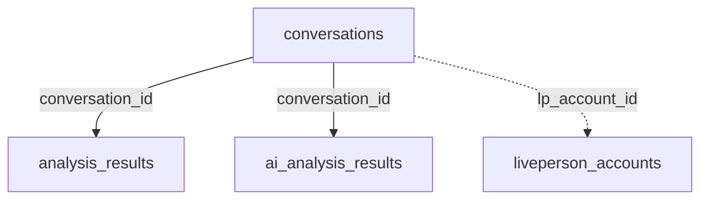

# Transcript Analyzer - Database Schema

This document describes the complete database schema for the Transcript Analyzer application.

## Database: SQLite (`transcripts.db`)

### Tables

#### 1. `conversations`
Stores uploaded and fetched conversation transcripts.

| Column | Type | Description |
|--------|------|-------------|
| id | INTEGER PRIMARY KEY | Auto-increment ID |
| conversation_id | TEXT UNIQUE NOT NULL | Unique conversation identifier |
| transcript_details | TEXT NOT NULL | Full transcript text |
| conversation_date | TEXT | Date of conversation |
| uploaded_at | DATETIME | Upload timestamp |
| message_count | INTEGER | Number of messages |
| duration_minutes | REAL | Conversation duration |
| source | TEXT | Source of conversation ('upload' or 'liveperson') |
| external_id | TEXT | External system ID (e.g., LivePerson conversation ID) |
| fetched_at | DATETIME | Fetch timestamp (for LivePerson) |
| lp_account_id | TEXT | LivePerson account ID (foreign key) |
| raw_lp_response | TEXT | Raw JSON response from LivePerson API |

#### 2. `liveperson_accounts`
Stores LivePerson API account credentials and configuration.

| Column | Type | Description |
|--------|------|-------------|
| id | INTEGER PRIMARY KEY | Auto-increment ID |
| account_name | TEXT NOT NULL UNIQUE | Display name for account |
| consumer_key | TEXT NOT NULL | OAuth consumer key |
| consumer_secret | TEXT NOT NULL | OAuth consumer secret |
| token | TEXT NOT NULL | OAuth token |
| token_secret | TEXT NOT NULL | OAuth token secret |
| account_id | TEXT NOT NULL | LivePerson account ID |
| service_name | TEXT | Service name (default: 'msgHist') |
| api_version | TEXT | API version (default: '1.0') |
| api_endpoint_path | TEXT | API endpoint path |
| is_active | BOOLEAN | Account active status |
| created_at | DATETIME | Creation timestamp |
| updated_at | DATETIME | Last update timestamp |

#### 3. `analysis_results`
Basic sentiment and keyword analysis results.

| Column | Type | Description |
|--------|------|-------------|
| id | INTEGER PRIMARY KEY | Auto-increment ID |
| conversation_id | TEXT NOT NULL | Foreign key to conversations |
| overall_sentiment | REAL | Overall sentiment score |
| sentiment_label | TEXT | Sentiment label (positive/negative/neutral) |
| positive_count | INTEGER | Count of positive messages |
| negative_count | INTEGER | Count of negative messages |
| neutral_count | INTEGER | Count of neutral messages |
| topics | TEXT | JSON array of topics |
| keywords | TEXT | JSON array of keywords |
| avg_message_length | REAL | Average message length |
| avg_response_time | REAL | Average response time |
| agent_performance_score | REAL | Agent performance score |
| customer_satisfaction_score | REAL | Customer satisfaction score |
| analyzed_at | DATETIME | Analysis timestamp |

**Foreign Keys:**
- `conversation_id` → `conversations(conversation_id)` ON DELETE CASCADE

#### 4. `ai_analysis_results`
Comprehensive AI-powered analysis results.

| Column | Type | Description |
|--------|------|-------------|
| id | INTEGER PRIMARY KEY | Auto-increment ID |
| conversation_id | TEXT UNIQUE NOT NULL | Foreign key to conversations |
| **Summarization** | | |
| summary | TEXT | 2-3 sentence summary |
| key_points | TEXT | JSON array of key points |
| resolved | BOOLEAN | Issue resolution status |
| action_items | TEXT | JSON array of action items |
| **Sentiment** | | |
| emotions | TEXT | JSON object of emotions |
| sentiment_trajectory | TEXT | JSON array of sentiment over time |
| emotional_turning_points | TEXT | JSON array of turning points |
| empathy_score | REAL | Agent empathy score (0-100) |
| **Intent** | | |
| primary_intent | TEXT | Primary conversation intent |
| secondary_intents | TEXT | JSON array of secondary intents |
| category | TEXT | Main category |
| subcategory | TEXT | Subcategory |
| complexity | TEXT | Complexity level (low/medium/high) |
| **Agent Performance** | | |
| communication_quality | REAL | Communication quality (0-100) |
| problem_solving_score | REAL | Problem solving score (0-100) |
| compliance_score | REAL | Compliance score (0-100) |
| personalization_score | REAL | Personalization score (0-100) |
| agent_strengths | TEXT | JSON array of strengths |
| agent_improvements | TEXT | JSON array of improvements |
| **QA** | | |
| policy_violations | TEXT | JSON array of violations |
| script_adherence_score | REAL | Script adherence (0-100) |
| risk_flags | TEXT | JSON array of risk flags |
| best_practice_suggestions | TEXT | JSON array of suggestions |
| **Customer Journey** | | |
| churn_risk_score | REAL | Churn risk (0-100) |
| churn_risk_factors | TEXT | JSON array of churn risk factors |
| churn_risk_level | TEXT | Risk level (low/medium/high) |
| customer_personality | TEXT | Personality type |
| lifetime_value_indicator | TEXT | LTV indicator (high/medium/low) |
| intervention_suggestions | TEXT | JSON array of interventions |
| **Metadata** | | |
| provider_used | TEXT | LLM provider used |
| tokens_used | INTEGER | Tokens consumed |
| cost | REAL | Analysis cost |
| processing_time_ms | INTEGER | Processing time in ms |
| analyzed_at | DATETIME | Analysis timestamp |
| custom_data | TEXT | JSON of full analysis (for custom prompts) |

**Foreign Keys:**
- `conversation_id` → `conversations(conversation_id)` ON DELETE CASCADE

#### 5. `sentiment_trends`
Aggregated daily sentiment trends for predictive analytics.

| Column | Type | Description |
|--------|------|-------------|
| id | INTEGER PRIMARY KEY | Auto-increment ID |
| date | DATE NOT NULL | Date of trend |
| avg_sentiment | REAL | Average sentiment score |
| conversation_count | INTEGER | Number of conversations |
| positive_count | INTEGER | Count of positive conversations |
| negative_count | INTEGER | Count of negative conversations |
| neutral_count | INTEGER | Count of neutral conversations |
| account_id | INTEGER | Account ID (for multi-account) |
| calculated_at | DATETIME | Calculation timestamp |

**Unique Constraints:**
- `(date, account_id)` - One trend record per date per account

**Indexes:**
- `idx_sentiment_trends_date` on `date`
- `idx_sentiment_trends_account` on `account_id`

#### 6. `ai_cost_tracking`
Tracks AI usage costs.

| Column | Type | Description |
|--------|------|-------------|
| id | INTEGER PRIMARY KEY | Auto-increment ID |
| date | DATE | Date of usage |
| provider | TEXT | LLM provider |
| conversations_analyzed | INTEGER | Number analyzed |
| total_tokens | INTEGER | Total tokens used |
| total_cost | REAL | Total cost |
| created_at | DATETIME | Record timestamp |

#### 7. `ai_settings`
Stores AI configuration settings.

| Column | Type | Description |
|--------|------|-------------|
| id | INTEGER PRIMARY KEY | Auto-increment ID |
| setting_key | TEXT UNIQUE NOT NULL | Setting key |
| setting_value | TEXT NOT NULL | Setting value |
| updated_at | DATETIME | Last update timestamp |

#### 8. `analysis_config`
Stores configuration for analysis algorithms.

| Column | Type | Description |
|--------|------|-------------|
| id | INTEGER PRIMARY KEY | Auto-increment ID |
| config_key | TEXT UNIQUE NOT NULL | Config key (e.g., sentiment_keywords) |
| config_value | TEXT NOT NULL | Config value (JSON string) |
| config_type | TEXT NOT NULL | Config type (sentiment/topic/performance/keywords) |
| updated_at | DATETIME | Last update timestamp |

**Default Configurations:**
- `sentiment_keywords`: Positive, negative, and neutral keyword lists
- `topic_patterns`: Pattern matching for billing, technical, shipping, account topics
- `topic_stop_words`: Stop words for topic extraction
- `performance_thresholds`: Performance scoring thresholds
- `keyword_extraction`: Keyword extraction configuration

#### 9. `ai_prompts`
Manages AI prompt templates.

| Column | Type | Description |
|--------|------|-------------|
| id | INTEGER PRIMARY KEY | Auto-increment ID |
| name | TEXT NOT NULL | Prompt name |
| description | TEXT | Prompt description |
| template | TEXT NOT NULL | Prompt template (with {{TRANSCRIPT}} placeholder) |
| is_active | BOOLEAN | Currently active flag |
| is_default | BOOLEAN | Default prompt flag |
| created_at | DATETIME | Creation timestamp |
| updated_at | DATETIME | Last update timestamp |

**Default Prompt:**
- Name: "Default Analysis"
- Description: "Standard comprehensive analysis prompt"
- Template: Combined analysis prompt from `prompts.js`

#### 10. `metric_configs`
Configures custom metric scoring and colors.

| Column | Type | Description |
|--------|------|-------------|
| id | INTEGER PRIMARY KEY | Auto-increment ID |
| metric_name | TEXT UNIQUE NOT NULL | Metric name (e.g., CES, NPS) |
| min_value | REAL NOT NULL | Minimum value |
| max_value | REAL NOT NULL | Maximum value |
| reverse_scale | BOOLEAN | True if lower is better |
| color_thresholds | TEXT | JSON array of color thresholds |
| created_at | DATETIME | Creation timestamp |

**Default Metric Configs:**
- **CES**: 1-5, thresholds: [≤2: red, ≤4: yellow, ≤5: green]
- **NPS**: -100 to 100, thresholds: [≤0: red, ≤50: yellow, ≤100: green]
- **CSAT**: 1-5, thresholds: [≤2: red, ≤4: yellow, ≤5: green]
- **churnRiskScore**: 0-100 (reverse), thresholds: [≤30: green, ≤70: yellow, ≤100: red]

#### 11. `metrics`
General metrics storage.

| Column | Type | Description |
|--------|------|-------------|
| id | INTEGER PRIMARY KEY | Auto-increment ID |
| metric_name | TEXT NOT NULL | Metric name |
| metric_value | REAL | Metric value |
| metric_data | TEXT | Additional data (JSON) |
| calculated_at | DATETIME | Calculation timestamp |

## Database Setup and Migration

### Initial Setup

To create the database from scratch:

1. **Delete existing database** (if needed):
   ```bash
   rm transcripts.db
   ```

2. **Start the server**:
   ```bash
   npm run dev
   ```

3. The database will be automatically created with all tables and seeded with:
   - Default AI prompt (comprehensive analysis)
   - Default metric configurations (CES, NPS, CSAT, churnRiskScore)
   - Default analysis configurations (sentiment keywords, topic patterns, etc.)

### Running Migrations

To apply schema updates to an existing database:

```bash
# Run all migrations
node scripts/run-migrations.js

# Run a specific migration
node migrations/add_predictive_insights.js
```

### Available Migrations

1. **add_predictive_insights.js** - Adds predictive analytics features:
   - Creates `sentiment_trends` table
   - Adds `churn_risk_score`, `churn_risk_factors`, `churn_risk_level` columns to `ai_analysis_results`
   - Backfills initial sentiment trends from existing data

### Creating a New Migration

1. Create a new file in `migrations/` directory:
   ```javascript
   import sqlite3 from 'sqlite3';
   import { fileURLToPath } from 'url';
   import { dirname, join } from 'path';
   
   const __filename = fileURLToPath(import.meta.url);
   const __dirname = dirname(__filename);
   const dbPath = join(__dirname, '..', 'transcripts.db');
   
   const db = new sqlite3.Database(dbPath);
   
   db.serialize(() => {
       // Your migration code here
       db.run(`ALTER TABLE table_name ADD COLUMN new_column TEXT`, (err) => {
           if (err) console.error('Error:', err);
           else console.log('✓ Migration completed');
           db.close();
       });
   });
   ```

2. Run the migration:
   ```bash
   node migrations/your_migration_name.js
   ```

### Database Backup

To backup the database:

```bash
# Create a backup
cp transcripts.db transcripts.db.backup

# Restore from backup
cp transcripts.db.backup transcripts.db
```

### Exporting Schema

To export the current schema:

```bash
sqlite3 transcripts.db .schema > schema.sql
```

## Foreign Key Relationships



**Note:** Foreign key constraints are enabled via `PRAGMA foreign_keys = ON`
